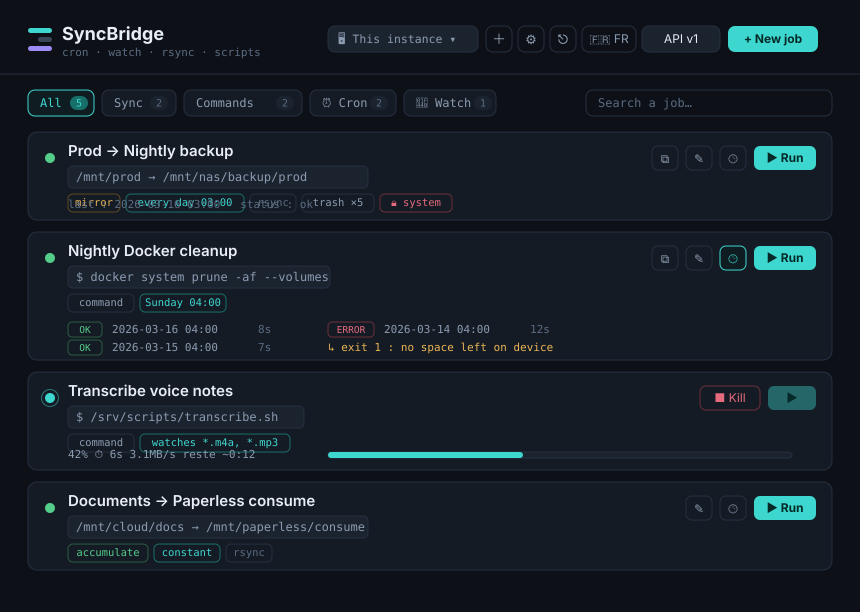
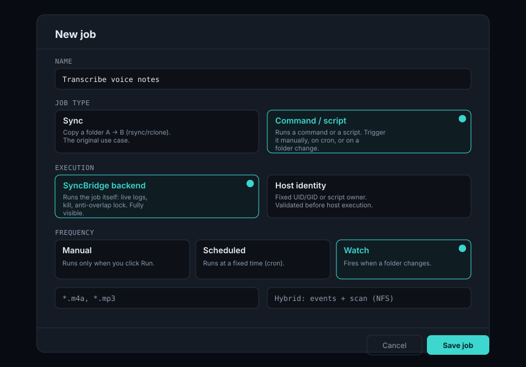

<p align="center">
  
</p>

<h1 align="center">SyncBridge</h1>

<p align="center"><strong>Host-native job execution from a small self-hosted control plane.</strong></p>

SyncBridge runs commands, scripts, and local sync jobs in the Linux host namespaces while the controller itself stays in a single hardened Docker container. Jobs can be started manually, scheduled by SyncBridge cron, or triggered by filesystem watches. Runs expose bounded logs, stop/timeout controls, overlap protection, and persistent terminal history.

## Highlights

- **Host execution** — direct `nsenter` execution into host mount/UTS/IPC/network/PID namespaces; no Docker socket.
- **Commands, scripts, sync** — free-form commands, host scripts, and rsync/rclone execution plans.
- **Explicit host identity** — fixed UID/GID or script-owner execution where supported; no silent root fallback.
- **Manual, cron, watch** — SyncBridge-owned triggers with debounce, glob filtering, hybrid event/poll watches, and bounded polling work.
- **Persistent host scheduling** — optional host-owned `/etc/cron.d` entries or systemd `.service/.path` units that invoke the same validated root-owned wrapper and survive a controller outage.
- **System inventory & import** — inspect host cron/systemd/inotify triggers, safely toggle/delete/restore discovered items after server-side revalidation, and import simple rsync/rclone commands from host paths.
- **Run lifecycle** — opaque run IDs, atomic overlap reservation, timeout, TERM→KILL stop, process-group handling, bounded logs, and retained history.
- **API v1** — revision-aware jobs, run start/list/stop, capabilities, and resumable SSE events.
- **Remote instances** — manage several reachable SyncBridge nodes from one UI; remote credentials are encrypted at rest.
- **Single-purpose host controller image** — read-only root filesystem, `pid: host`, `SYS_ADMIN` + `SYS_PTRACE`, default seccomp retained, no host `/etc`, `/proc`, `/home`, `/mnt`, or `docker.sock` bind mounts.
- **Multi-arch publication** — CI verifies the code and deployment contract before publishing `linux/amd64` and `linux/arm64` images.

<p align="center"></p>
<p align="center"></p>

## Requirements

The host must provide the tools required by the jobs you plan to run. SyncBridge probes host capabilities at startup through `nsenter`; the image intentionally does not bundle rsync, rclone, Docker CLI, shells, or application-specific tools just to execute host work.

Container requirements:

- Linux host with PID namespace sharing available;
- Docker Engine / compatible Compose implementation;
- `pid: host`;
- `CAP_SYS_ADMIN` for namespace entry;
- `CAP_SYS_PTRACE` for dereferencing the host filesystem view at `/proc/1/root`;
- AppArmor disabled for this container (`apparmor=unconfined`) when AppArmor is active, because Docker's `docker-default` profile blocks the cross-profile `/proc/1/root`/host-namespace access SyncBridge is designed to perform;
- a writable config directory mounted only at `/config`.

## Quick start

```bash
mkdir -p /opt/syncbridge
curl -fsSLO https://raw.githubusercontent.com/GodsQuantum/SyncBridge/main/deploy/compose.yaml
curl -fsSLO https://raw.githubusercontent.com/GodsQuantum/SyncBridge/main/deploy/syncbridge.env.example
cp syncbridge.env.example .env

docker compose --env-file .env -f compose.yaml up -d
```

Then open `http://HOST:8787`. The first account registered becomes the administrator.

The generic example is in [`deploy/compose.yaml`](deploy/compose.yaml). Configuration variables are documented in [`deploy/syncbridge.env.example`](deploy/syncbridge.env.example) and [`docs/deployment.md`](docs/deployment.md).

## Security model

SyncBridge is deliberately a **host execution controller**, not a container sandbox. `pid: host` plus `CAP_SYS_ADMIN` allows it to enter host namespaces; `CAP_SYS_PTRACE` permits the ptrace-gated `/proc/1/root` filesystem view used by the folder browser and watch manager. On AppArmor hosts, the generic Compose also sets `apparmor=unconfined`: Docker's default profile intentionally blocks the cross-profile host access that SyncBridge requires. Anyone with administrative access to SyncBridge should therefore be treated as having host-level execution capability.

This is an explicit trust tradeoff, not an additional hardening layer. The public Compose still reduces unrelated exposure:

- no `privileged: true`;
- no Docker socket;
- no host filesystem bind mounts other than the dedicated `/config` directory;
- read-only container root;
- `no-new-privileges` and Docker's default seccomp profile;
- AppArmor unconfined only for the SyncBridge container because its purpose requires host namespace/filesystem access;
- small tmpfs mounts for `/tmp` and `/run`.

Do not expose SyncBridge directly to an untrusted network. Put it behind your authenticated reverse proxy/VPN and TLS policy. See [`SECURITY.md`](.github/SECURITY.md).

## Execution model

```text
HTTP / cron / watch
        │
        ▼
    RunService
        │
        ├── immutable job snapshot
        ├── overlap / timeout / logs / history
        ▼
   PlanCompiler
        ▼
  WrapperStore ────── host wrapper
        │
        ▼
   HostExecutor
        │
        ▼
 nsenter → host process group
```

Filesystem watches, browsing, system inventory, import scanning, and persistent scheduler file operations keep host paths in the persisted model but resolve filesystem I/O through `/proc/1/root`, so the hardened container does not need broad `/home`, `/mnt`, `/etc`, or `/proc` bind mounts. Host manager commands such as `systemctl` run through the same `nsenter` boundary.

More detail: [`docs/architecture.md`](docs/architecture.md).

## Host system inventory and persistent scheduling

The web UI includes **Import** for host cron/systemd/inotify discovery and rsync/rclone command discovery. System mutations are never authorized by a browser-supplied path alone: SyncBridge rescans the host and requires the requested item to still match before toggling or deleting it. Deleted cron/systemd definitions are stored in the local `/config` trash for explicit restoration.

Jobs using `scheduler.owner=system` are materialized on the host. Cron jobs use a marked `/etc/cron.d` file; watch jobs use a systemd `.service` + `.path`. Both invoke only the validated SyncBridge host wrapper, so the declared execution identity remains enforced.

To scan additional host script trees for importable rsync/rclone commands, set `SYNCBRIDGE_IMPORT_PATHS` in the deployment environment to a colon-separated list of **host paths**, for example `/srv/scripts:/opt/automation`. No matching Docker bind mounts are required.

## API v1

Primary endpoints:

- `GET|POST /api/v1/jobs`
- `GET|PUT|DELETE /api/v1/jobs/{id}`
- `GET|POST /api/v1/jobs/{id}/runs`
- `GET /api/v1/runs/{runID}`
- `POST /api/v1/runs/{runID}/stop`
- `GET /api/v1/events`
- `GET /api/v1/capabilities`

Job mutation uses persisted revisions/ETags. The current web UI also uses compatibility adapters under `/api/jobs`; they delegate to the same repository and run service rather than maintaining a second execution state.

## Development

```bash
go test ./...
go test -race ./...
go vet ./...
go build ./cmd/syncbridge
node --check cmd/syncbridge/web/app.js
```

The publish workflow additionally validates the rendered Compose model, builds and smoke-tests the image, verifies host namespace/filesystem access, then publishes the multi-architecture image.

## Documentation

- [Deployment](docs/deployment.md)
- [Architecture](docs/architecture.md)
- [Documentation française](docs/README.fr.md)
- [Security policy](.github/SECURITY.md)

## License

[MIT](LICENSE)
